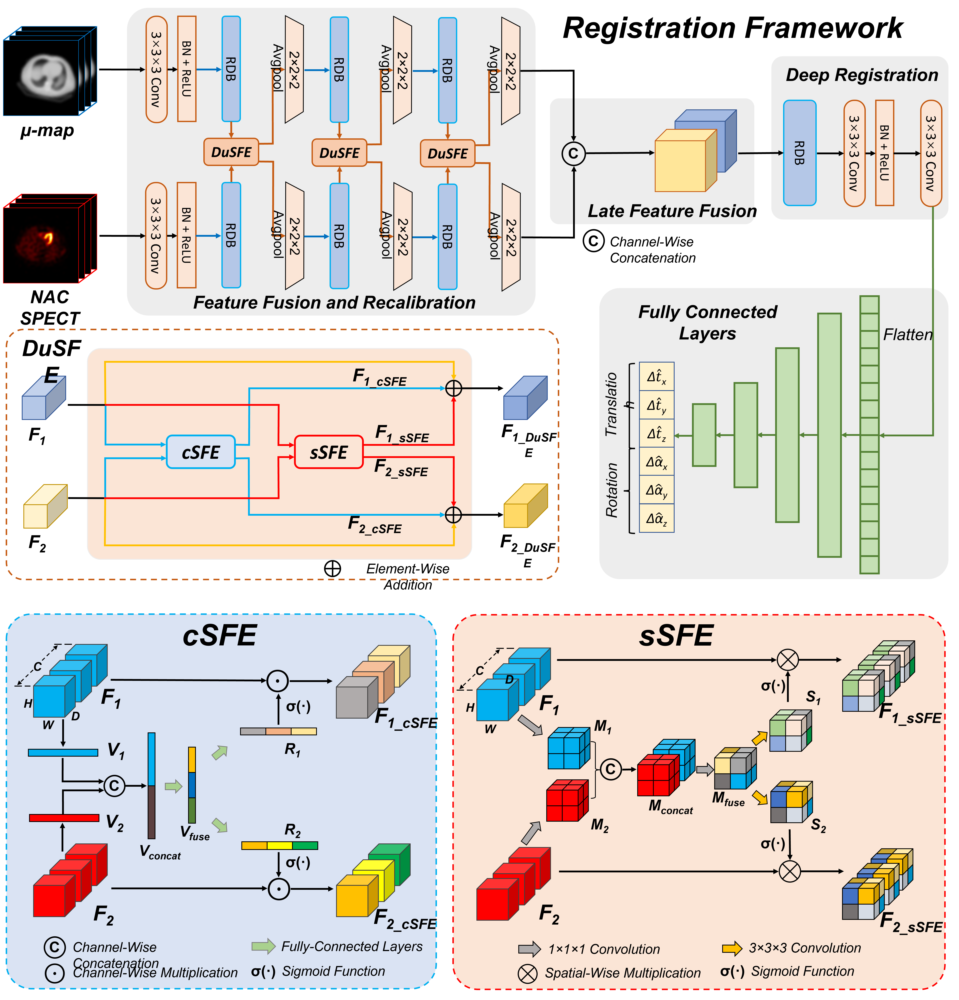

# Dual-Branch Squeeze-Fusion-Excitation Module for Cross-Modality Registration of Cardiac SPECT and CT

Xiongchao Chen, Bo Zhou, Huidong Xie, Xueqi Guo, Jiazhen Zhang, Albert J. Sinusas, John A. Onofrey, and Chi Liu



[[Paper]()]

This repository contains the PyTorch implementation of Dual-Branch Squeeze-Fusion-Excitation (DuSFE) Module for cross-modality SPECT-CT registration.

<!-- ### Citation
If you use this code for your research or project, please cite:
... -->


 ### Environment and Dependencies
 Requirements:
 * Python 3.6.10
 * Pytorch 1.2.0
 * numpy 1.19.2
 * scipy
 * scikit-image
 * h5py
 * tqdm
 
 Our code has been tested with Python 3.6.10, Pytorch 1.2.0, CUDA: 10.0.130 on Ubuntu 18.04.6.

 ### Dataset Setup
    .
    Data
    ├── train                # contain training files
    |   ├── data1.h5
    |       ├── Amap_Trans.mat  
    |       ├── Amap_CT.mat
    |       ├── SPECT_NC.mat
    |       ├── SPECT_SC.mat
    |       ├── Index_Trans.mat
    |   └── ...  
    |
    ├── valid                # contain validation files
    |   ├── data1.h5
    |       ├── Amap_Trans.mat  
    |       ├── Amap_CT.mat
    |       ├── SPECT_NC.mat
    |       ├── SPECT_SC.mat
    |       ├── Index_Trans.mat
    |   └── ... 
    |
    └── test                 # contain testing files
    |   ├── data1.h5
    |       ├── Amap_Trans.mat  
    |       ├── Amap_CT.mat
    |       ├── SPECT_NC.mat
    |       ├── SPECT_SC.mat
    |       ├── Index_Trans.mat
    |   └── ... 
    └── ...  

where \
`Amap_Trans`: rotated CT-based attenuation map with a size of H x W x H. \
`Amap_CT`: aligned CT-based attenuation maps with a size of H x W x H. \
`SPECT_NC`: reconstructed cardiac SPECT image in a photopeak window with a size of H x W x H. \
`SPECT_SC`: reconstructed cardiac SPECT image in a scatter window with a size of H x W x H (optional). \
`Index_Trans`: rigid transformation index with a size of 6 x 1 (3 translational index, 3 rotational index). 

### To Run the Code
Sample training/testing scripts are provided at the root folder as `train_register.sh` and `train_register.sh`.

- Train the model 
```bash
python train.py --experiment_name 'train_register' --model_type 'model_reg' --dataset 'CardiacSPECT_Reg' --data_root '../../Data/Processed_2022x01x21_1_400Train_demo/' --net_G 'DuRegister_DuSE' --net_filter 32 --lr 5e-5 --step_size 1 --gamma 0.99 --n_epochs 400 --batch_size 4 --n_patch_train 1 --patch_size_train 80 80 40 --n_patch_test 1 --patch_size_test 80 80 40 --n_patch_valid 1 --patch_size_valid 80 80 40 --eval_epochs 5 --snapshot_epochs 5 --gpu_ids 1
```


### Contact 
If you have any question, please file an issue or contact the author:
```
Xiongchao Chen: xiongchao.chen@yale.edu, cxiongchao9587@gmail.com
```


