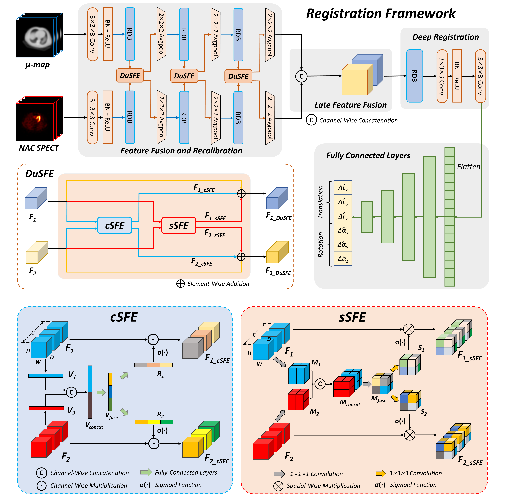

# Dual-Branch Squeeze-Fusion-Excitation Module for Cross-Modality Registration of Cardiac SPECT and CT

Xiongchao Chen, Bo Zhou, Huidong Xie, Xueqi Guo, Jiazhen Zhang, Albert J. Sinusas, John A. Onofrey, and Chi Liu



[[Paper]()]

This repository contains the PyTorch implementation of Dual-Branch Squeeze-Fusion-Excitation (DuSFE) Module for cross-modality SPECT-CT registration.

<!-- ### Citation
If you use this code for your research or project, please cite:
... -->


 ### Environment and Dependencies
 Requirements:
 * Python 3.6.10
 * Pytorch 1.2.0
 * numpy 1.19.2
 * scipy
 * scikit-image
 * h5py
 * tqdm
 
 Our code has been tested with Python 3.6.10, Pytorch 1.2.0, CUDA: 10.0.130 on Ubuntu 18.04.6.

 ### Dataset Setup
    .
    Data
    ├── train                # contain training files
    |   ├── data1.h5
    |       ├── Amap_Trans.mat  
    |       ├── Amap_CT.mat
    |       ├── SPECT_NC.mat
    |       ├── SPECT.mat
    |       ├── SC3.mat
    |       ├── GD.mat
    |       ├── BMI.mat
    |       ├── STATE.mat
    |   └── ...  
    |
    ├── valid                # contain validation files
    |   ├── data1.h5
    |       ├── AC.mat  
    |       ├── NC.mat
    |       ├── SC.mat
    |       ├── SC2.mat
    |       ├── SC3.mat
    |       ├── GD.mat
    |       ├── BMI.mat
    |       ├── STATE.mat
    |   └── ... 
    |
    └── test                 # contain testing files
    |   ├── data1.h5
    |       ├── AC.mat  
    |       ├── NC.mat
    |       ├── SC.mat
    |       ├── SC2.mat
    |       ├── SC3.mat
    |       ├── GD.mat
    |       ├── BMI.mat
    |       ├── STATE.mat
    |   └── ... 
    └── ...  


### Contact 
If you have any question, please file an issue or contact the author:
```
Xiongchao Chen: xiongchao.chen@yale.edu, cxiongchao9587@gmail.com
```


